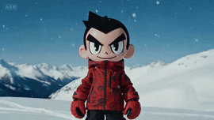
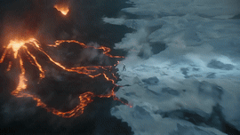

"# 🚀 Awesome Seedance 2.0 Prompts

> 精选高质量 Seedance 2.0 视频生成提示词库，助你快速掌握 AI 视频创作技巧

## ✨ 特性

- 🎬 **10+ 精选案例** - 涵盖多风格视频模板
- 📖 **完整提示词** - 提供可直接使用的 prompt
- 🎥 **分镜脚本** - 详细的时间轴与镜头说明
- 🖼️ **GIF 预览** - GitHub 直接播放
- 📁 **本地资源** - 无需外链，离线可用

## 🎯 适用人群

- 🎨 视频创作者
- 🤖 AI 爱好者
- 🎞️ 短视频博主
- 📕 设计师 & 动画师

## 🏗️ 项目结构

```
awesome-seedance-prompts/
├── README.md          # 项目说明
└── source/            # 视频源文件
    ├── video1.mp4/gif # 淡水夕阳篇
    ├── video2.mp4/gif # 直播带货篇
    └── ...
```

## 🤝 贡献

欢迎提交 PR 分享你的 Seedance 2.0 作品！

---

## 📹 精选视频

### 🎬 视频 1 | 淡水夕阳篇

**极致第一人称女友视角 - 台北淡水河夕阳约会**


| 项目 | 详情 |
|------|------|
| **时长** | 15秒 |
| **风格** | 女友视角、手持自拍VLOG、胶片感滤镜、自然光（夕阳黄金时刻）、镜头有自然的晃动和调整 |
| **主角** | 台湾女生，长发微卷，穿着温柔的针织开衫，妆容清透，说话语气软糯、带点撒娇和抱怨的口音(台湾腔) |
| **场景** | 台北淡水河岸边，背景是金色的夕阳、波光粼粼的河面和远处的情人桥 |
| **视频来源** | [X (Twitter)](https://x.com/i/status/2021252179923787806) |
| **本地视频** | `source/video1.mp4` / `source/video1.gif` |

---

#### 📝 核心提示词

**风格设置：**
> 极致第一人称女友视角(Ultimate Girlfriend POV)，手持自拍VLOG，竖屏(9:16)，胶片感滤镜(Film Grain)，自然光(夕阳黄金时刻)，镜头有自然的晃动和调整。

**人物描述：**
> 台湾女生，长发微卷，穿着温柔的针织开衫，妆容清透，说话语气软糯、带点撒娇和抱怨的口音(台湾腔)。

**场景描述：**
> 台北淡水河岸边，背景是金色的夕阳、波光粼粼的河面和远处的情人桥。

---

#### 📋 完整提示词原文

```
【风格】极致第一人称女友视角(Ultimate Girlfriend POV)，手持自拍VLOG，竖屏(9:16)，胶片感滤镜(Film Grain)，自然光(夕阳黄金时刻)，镜头有自然的晃动和调整。
【时长】15秒
【主角】台湾女生，长发微卷，穿着温柔的针织开衫，妆容清透，说话语气软糯、带点撒娇和抱怨的口音(台湾腔)。
【场景】台北淡水河岸边，背景是金色的夕阳、波光粼粼的河面和远处的情人桥。

[00:00-00:05] 镜头1：赶路与抱怨(The Rushed Intro)。
画面：镜头晃动得比较厉害，因为她在快走。她一边走一边回头看镜头（看你），眉头微皱，假装生气。
动作：一只手举着手机，另一只手还要压住被风吹乱的头发。
【台词/口型】（软糯抱怨音）："欸你走快一点啦！太阳快要下山了捏！都是你拖拖拉拉的，等一下拍不到好看的照片我要生气喔！"

[00:00-00:10] 镜头2：绝美景色分享(Sharing the View)。
画面：她停下脚步，把镜头从自己脸上移开，转向河对岸绝美的金色夕阳（Golden Hour）。
动作：镜头展示了2秒景色，然后马上又转回对准她的脸。她的脸被夕阳照得金灿灿的，露出超级开心的笑容，眼睛眯成一条缝。
【台词/口型】（惊叹音）："哇～你快看！有没有超美！这个光线真的绝了，随便拍都好看！"

提示词1-【名称】
[00:10-00:15] 镜头3：互动与结尾(The Interaction)。
画面：她手里突然多了一支淡水特有的超高霜冰淇淋。
动作：她先把霜冰淇淋举到镜头前（喂你），然后自己快速舔了一口，鼻尖不小心沾到一点冰淇淋。她对着镜头傻笑。
【台词/口型】（调皮音）："呐，第一口先给你吃。快点，要融化了啦！嘻嘻，今天的约会算你及格！"
```

---

#### 🎬 分镜脚本

| 时间段 | 镜头名称 | 画面描述 | 台词/口型 |
|--------|---------|----------|----------|
| [00:00-00:05] | 镜头1：赶路与抱怨 | 镜头晃动得比较厉害，因为她在快走。她一边走一边回头看镜头（看你），眉头微皱，假装生气。一只手举着手机，另一只手还要压住被风吹乱的头发。 | "欸你走快一点啦！太阳快要下山了捏！都是你拖拖拉拉的，等一下拍不到好看的照片我要生气喔！" |
| [00:05-00:10] | 镜头2：绝美景色分享 | 她停下脚步，把镜头从自己脸上移开，转向河对岸绝美的金色夕阳（Golden Hour）。镜头展示了2秒景色，然后马上又转回对准她的脸。她的脸被夕阳照得金灿灿的，露出超级开心的笑容，眼睛眯成一条缝。 | "哇～你快看！有没有超美！这个光线真的绝了，随便拍都好看！" |
| [00:10-00:15] | 镜头3：互动与结尾 | 她手里突然多了一支淡水特有的超高霜冰淇淋。先举到镜头前（喂你），然后自己快速舔了一口，鼻尖不小心沾到一点冰淇淋。她对着镜头傻笑。 | "呐，第一口先给你吃。快点，要融化了啦！嘻嘻，今天的约会算你及格！" |

---

### 🎬 视频 2 | 直播带货篇

**抖音直播带货风 - 激情推荐Seedance 2.0**


| 项目 | 详情 |
|------|------|
| **时长** | 15秒 |
| **风格** | 抖音直播带货风，极速语速(Rap-like Speed)，情绪极其亢奋 |
| **主角** | 激情带货主播（网红美女），面前摆着手机平板，背景是杂乱但真实的高端直播间 |
| **视频来源** | [X (Twitter)](https://x.com/i/status/2021199692650946709) |
| **本地视频** | `source/video2.mp4` / `source/video2.gif` |

---

#### 📝 核心提示词

**风格设置：**
> 抖音直播带货风，极速语速(Rap-like Speed)，情绪极其亢奋。

**人物描述：**
> 激情带货主播（网红美女），面前摆着手机平板，背景是杂乱但真实的高端直播间。

---

#### 📋 完整提示词原文

```
【风格】抖音直播带货风，极速语速(Rap-like Speed)，情绪极其亢奋。
【时长】15秒
【主角】激情带货主播（网红美女），面前摆着手机平板，背景是杂乱但真实的高端直播间。

[00:00-00:05] 镜头1：痛点爆破(The Hook)。
画面：分屏显示。左边是模糊扭曲的PPT式AI视频（打上大大的红叉），右边是电影级质感的Seedance生成视频。
动作：主播猛拍桌子，把脸凑近镜头，表情痛心疾首。
【语速极快/喊麦感】："别再用那些全网都在推的垃圾模型了！生成的视频脸都歪了还能看吗？家人们，今天我把Seedance 2.0的价格给你们打下来了！"

[00:05-00:10] 镜头2：实操炸场(The Demo)。
画面：特写手机屏幕。主播输入："赛博朋克雨夜，少女回眸"。按下生成键，进度条瞬间跑满（0.5秒）。
特效：屏幕上瞬间炸出（粒子光影弹出）一段4K、60帧、毛发毕现的绝美视频。
动作：主播指着屏幕疯狂敲击，口沫横飞。
【语速极快】："看这个速度！看这个光影！不用显卡，不用排队！这就是Seedance 2.0！好莱坞导演都在用！"

[00:10-00:15] 镜头3：限时逼单(The Call to Action)。
画面：主播身后出现巨大的倒计时（只剩3秒），屏幕下方出现疯狂闪烁的"免费试用"小黄车图标。
动作：主播双手合十拜托，然后疯狂指着屏幕下方。
【语速极快】："全网首发！仅限前100名免费试用！链接就在左下角！手慢无！给我冲！3、2、1，上链接！"
```

---

#### 🎬 分镜脚本

| 时间段 | 镜头名称 | 画面描述 | 台词/口型 |
|--------|---------|----------|----------|
| [00:00-00:05] | 镜头1：痛点爆破 | 分屏显示。左边是模糊扭曲的PPT式AI视频（打上大大的红叉），右边是电影级质感的Seedance生成视频。主播猛拍桌子，把脸凑近镜头，表情痛心疾首。 | "别再用那些全网都在推的垃圾模型了！生成的视频脸都歪了还能看吗？家人们，今天我把Seedance 2.0的价格给你们打下来了！" |
| [00:05-00:10] | 镜头2：实操炸场 | 特写手机屏幕。主播输入："赛博朋克雨夜，少女回眸"。按下生成键，进度条瞬间跑满（0.5秒）。屏幕上瞬间炸出4K、60帧、毛发毕现的绝美视频。 | "看这个速度！看这个光影！不用显卡，不用排队！这就是Seedance 2.0！好莱坞导演都在用！" |
| [00:10-00:15] | 镜头3：限时逼单 | 主播身后出现巨大的倒计时（只剩3秒），屏幕下方出现疯狂闪烁的"免费试用"小黄车图标。主播双手合十拜托，然后疯狂指着屏幕下方。 | "全网首发！仅限前100名免费试用！链接就在左下角！手慢无！给我冲！3、2、1，上链接！" |

---

### 🎬 视频 3 | 神豪爽剧篇

**国产神豪爽剧 - 豪华婚礼现场反转**


| 项目 | 详情 |
|------|------|
| **时长** | 15秒 |
| **风格** | 国产神豪爽剧（Viral CEO Drama），竖屏构图（Portrait Mode），高饱和度滤镜，极致的面部特写，情绪大开大合 |
| **角色** | 被羞辱的新郎（穿着廉价西装，眼神隐忍不发）VS 刻薄丈母娘（满身珠宝，一脸嫌弃） |
| **视频来源** | [X (Twitter)](https://x.com/i/status/2020688711172620665) |
| **本地视频** | `source/video3.mp4` / `source/video3.gif` |

---

#### 📝 核心提示词

**风格设置：**
> 国产神豪爽剧（Viral CEO Drama），竖屏构图（Portrait Mode），高饱和度滤镜，极致的面部特写，情绪大开大合。

**角色描述：**
> 被羞辱的新郎（穿着廉价西装，眼神隐忍不发）VS 刻薄丈母娘（满身珠宝，一脸嫌弃）。

---

#### 📋 完整提示词原文

```
【风格】国产神豪爽剧（Viral CEO Drama），竖屏构图（Portrait Mode），高饱和度滤镜，极致的面部特写，情绪大开大合。
【时长】15秒
【角色】被羞辱的新郎（穿着廉价西装，眼神隐忍不发）VS 刻薄丈母娘（满身珠宝，一脸嫌弃）。

[00:00-00:05] 镜头1：极致羞辱（Humiliation）。
画面：豪华婚礼现场。丈母娘当着众人的面，将一纸"退婚书"狠狠摔在男主胸口，周围宾客哄堂大笑。
动作：丈母娘手指戳着男主的额头。
【对白口型指导】"没车没房还想娶我女儿？拿着这一百块滚出去！"

[00:05-00:10] 镜头2：风云突变（The Turn）。
画面：豪华婚礼现场。丈母娘当着众人的面，将一纸"退婚书"狠狠摔在男主胸口，周围宾客哄堂大笑。
动作：男主突然冷笑一声，撕碎退婚书。此时，巨大的螺旋桨声（音效感）盖过全场，狂风吹乱了丈母娘的发型。男主整理了一下衣领，气场瞬间变得霸气侧漏。
【对白口型指导】"这婚，可是你们要退的。"

[00:10-00:15] 镜头3：神豪降临（The Reveal）。
画面：大门被撞开，两排黑衣保镖冲进来，单膝跪地铺上红地毯。一位老管家颤抖着捧着一件黄袍（或至尊黑卡）跑到男主面前深深鞠躬。丈母娘吓得瘫坐在地上，瞳孔地震。
动作：老管家鞠躬。
【对白口型指导】老管家喊："恭迎龙王（少爷）归位！家族资产已解冻！"
```

---

#### 🎬 分镜脚本

| 时间段 | 镜头名称 | 画面描述 | 台词/口型 |
|--------|---------|----------|----------|
| [00:00-00:05] | 镜头1：极致羞辱 | 豪华婚礼现场。丈母娘当着众人的面，将一纸"退婚书"狠狠摔在男主胸口，周围宾客哄堂大笑。丈母娘手指戳着男主的额头。 | "没车没房还想娶我女儿？拿着这一百块滚出去！" |
| [00:05] | 镜头-00:102：风云突变 | 男主突然冷笑一声，撕碎退婚书。此时，巨大的螺旋桨声盖过全场，狂风吹乱了丈母娘的发型。男主整理了一下衣领，气场瞬间变得霸气侧漏。 | "这婚，可是你们要退的。" |
| [00:10-00:15] | 镜头3：神豪降临 | 大门被撞开，两排黑衣保镖冲进来，单膝跪地铺上红地毯。老管家捧着一件黄袍（或至尊黑卡）跑到男主面前深深鞠躬。丈母娘吓得瘫坐在地上。 | 老管家喊："恭迎龙王（少爷）归位！家族资产已解冻！" |

---

### 🎬 视频 4 | 镜子悬疑篇

**伪纪录片风格 - 卫生间镜子灵异事件**


| 项目 | 详情 |
|------|------|
| **时长** | 15秒 |
| **风格** | 伪纪录片（Vlog Style），超写实主义，固定机位实拍感，自然光，带有一点点悬疑喜剧色彩 |
| **主角** | 普通的年轻人美女，在自家卫生间洗漱台前 |
| **视频来源** | [X (Twitter)](https://x.com/i/status/2020788951678607813) |
| **本地视频** | `source/video4.mp4` / `source/video4.gif` |

---

#### 📝 核心提示词

**风格设置：**
> 伪纪录片（Vlog Style），超写实主义，固定机位实拍感，自然光，带有一点点悬疑喜剧色彩。

**角色描述：**
> 普通的年轻人美女，在自家卫生间洗漱台前。

---

#### 📋 完整提示词原文

```
【风格】伪纪录片（Vlog Style），超写实主义，固定机位实拍感，自然光，带有一点点悬疑喜剧色彩。
【时长】15秒
【主角】一个普通的年轻人美女，在自家卫生间洗漱台前。

[00:00-00:06] 镜头1：日常铺垫（Normalcy）。
场景：普通的卫生间大镜子前。
动作：主角正在对着镜子刷牙，满嘴泡沫。她一边刷牙一边对着镜子做各种搞怪的鬼脸（挤眉弄眼）。
关键细节：此时镜子里的倒影完全正常，动作同步。

[00:06-00:11] 镜头2：BUG出现（The Glitch）。
动作：主角刷完牙，低头吐掉泡沫，然后转身准备离开卫生间。
高能时刻（核心爆点）：就在主角真身已经转身离开镜子画面范围的时候，镜子里的那个"倒影"竟然没有动！那个"倒影"依然保持着刷牙的姿势，甚至还坏笑着冲着镜头挑了一下眉毛，停留了整整2秒钟，才突然惊慌失措地"快进"追上本体的动作消失。
导演备注：要做出极其真实的"网络延迟"感，倒影有独立意识的感觉。

[00:11-00:15] 镜头3：喜剧回马枪（The Punchline）。
动作：已经走到门口的主角似乎感觉到了不对劲，猛地回头看向镜子。
结果：镜子此时已经完全恢复正常，空空荡荡，只照出对面的墙壁。主角一脸懵逼地挠头，对着镜头露出怀疑人生的表情。画面在主角的懵逼脸中定格（喜剧效果）。
```

---

#### 🎬 分镜脚本

| 时间段 | 镜头名称 | 画面描述 | 台词/口型 |
|--------|---------|----------|----------|
| [00:00-00:06] | 镜头1：日常铺垫 | 普通的卫生间大镜子前。主角正在对着镜子刷牙，满嘴泡沫。她一边刷牙一边对着镜子做各种搞怪的鬼脸（挤眉弄眼）。此时镜子里的倒影完全正常，动作同步。 | 无 |
| [00:06-00:11] | 镜头2：BUG出现 | 主角刷完牙，低头吐掉泡沫，然后转身准备离开。就在主角真身已经转身离开镜子画面范围的时候，镜子里的那个"倒影"竟然没有动！依然保持着刷牙的姿势，甚至还坏笑着冲着镜头挑了一下眉毛，停留了整整2秒钟，才突然惊慌失措地"快进"追上本体的动作消失。 | 无 |
| [00:11-00:15] | 镜头3：喜剧回马枪 | 主角感觉到不对劲，猛地回头看向镜子。镜子此时已经完全恢复正常，空空荡荡，只照出对面的墙壁。主角一脸懵逼地挠头，对着镜头露出怀疑人生的表情。 | 无 |

---

### 🎬 视频 5 | 哥特战斗篇

**史诗级CG战斗 - 女战士与黑龙的史诗对决**


| 项目 | 详情 |
|------|------|
| **时长** | 15秒 |
| **风格** | 快节奏剪辑，无慢动作，撞击时镜头剧烈晃动，灰尘爆裂，近距离特写捕捉武器与鳞甲碰撞瞬间，全程保持昏暗哥特氛围，火光与暮光交织 |
| **角色** | 女战士、黑甲战士、黑龙 |
| **场景** | 哥特式大教堂废墟，石柱倾颓，暮光透过破碎彩窗，尘埃飘浮 |
| **视频来源** | [X (Twitter)](https://x.com/i/status/2021277605224165468) |
| **本地视频** | `source/video5.mp4` / `source/video5.gif` |

---

#### 📝 核心提示词

**风格设置：**
> 快节奏剪辑，无慢动作，撞击时镜头剧烈晃动，灰尘爆裂，近距离特写捕捉武器与鳞甲碰撞瞬间，全程保持昏暗哥特氛围，火光与暮光交织。

**场景描述：**
> 哥特式大教堂废墟，石柱倾颓，暮光透过破碎彩窗，尘埃飘浮。

**角色描述：**
> 女战士持矛，黑甲战士持盾，与一条黑龙进行史诗级战斗。

---

#### 📋 完整提示词原文

```
用图片中的三个角色和场景制作一场战斗

【场景设定】
哥特式大教堂废墟，石柱倾颓，暮光透过破碎彩窗，尘埃飘浮。

第0-3秒：
女战士持矛警戒前行，镜头跟随其背影推进。突然，黑龙从阴影中猛扑，利爪撕裂地面石板，碎石爆溅。女战士翻滚闪避，长矛划出弧光。镜头剧烈震颤，龙吼震荡教堂。

第4-6秒：
黑甲战士冲入，盾牌猛击龙首侧面，金属撞击骨骼的沉闷轰鸣。龙头被撞向一侧，利齿甩出唾液飞沫。快速切至女战士，她借势跃起，矛尖直刺龙颈鳞片缝隙，火花迸溅。镜头跟随矛尖冲击瞬间。

第7-9秒：
黑龙暴怒甩尾横扫，尾刃斩断石柱。柱体轰然倒塌，砸向两名战士。黑甲战士举盾硬扛，盾面凹陷，双脚在地面犁出深痕。女战士低身滑行穿过碎石雨，长矛在地面摩擦出火星。龙翼展开遮蔽光线，教堂陷入阴影。

第10-12秒：
女战士猛刺龙腹，矛身深陷。黑龙痛苦仰首咆哮,颈部膨胀,喉咙涌动红光。黑甲战士察觉危险，冲刺抱摔女战士向后翻滚。下一瞬,龙炎喷涌而出,火柱吞没两人刚才位置,石板融化成岩浆。镜头在热浪中扭曲变形。

第13-15秒：
两名战士同时发动终结。黑甲战士从侧翼盾击龙颈关节，女战士正面全力投掷长矛，矛身旋转穿透龙喉。黑龙身体僵直，重重砸落地面，震起漫天灰尘。镜头拉远定格：两名战士喘息伫立，巨龙横尸教堂中央，破碎彩窗透入的暮光照亮战场废墟。快速转黑。

【风格说明】
• 快节奏剪辑，无慢动作
• 撞击时镜头剧烈晃动，灰尘爆裂
• 近距离特写捕捉武器与鳞甲碰撞瞬间
• 全程保持昏暗哥特氛围，火光与暮光交织
• 音效：金属碰撞、龙吼、石柱崩塌、火焰呼啸

【镜头运动】
跟随推进 → 震颤特写 → 横摇扫射 → 热浪扭曲 → 拉远定格
```

---

#### 🎬 分镜脚本

| 时间段 | 镜头名称 | 画面描述 |
|--------|---------|----------|
| [00:00-00:03] | 女战士遭遇黑龙 | 女战士持矛警戒前行，镜头跟随其背影推进。黑龙从阴影中猛扑，利爪撕裂地面石板，碎石爆溅。女战士翻滚闪避，长矛划出弧光。 |
| [00:04-00:06] | 黑甲战士助攻 | 黑甲战士冲入，盾牌猛击龙首侧面。龙头被撞向一侧。女战士借势跃起，矛尖直刺龙颈鳞片缝隙，火花迸溅。 |
| [00:07-00:09] | 黑龙甩尾攻击 | 黑龙暴怒甩尾横扫，尾刃斩断石柱。柱体轰然倒塌。黑甲战士举盾硬扛。女战士低身滑行穿过碎石雨。 |
| [00:10-00:12] | 龙炎喷射 | 女战士猛刺龙腹。黑龙痛苦仰首咆哮，颈部膨胀，喉咙涌动红光。黑甲战士察觉危险，抱摔女战士向后翻滚。龙炎喷涌而出，火柱吞没位置。 |
| [00:13-00:15] | 终极击杀 | 两名战士同时发动终结。黑甲战士侧翼盾击龙颈，女战士正面投掷长矛。黑龙身体僵直，重重砸落地面。镜头拉远定格。 |

---

### 🎬 视频 6 | 洗车反转篇

**抖音搞笑段子 - 老板与员工的反转剧**


| 项目 | 详情 |
|------|------|
| **时长** | 15秒 |
| **风格** | 抖音搞笑段子（Viral Sketch Comedy），竖屏（Portrait），生活化运镜，演员表情夸张，音效卡点清晰 |
| **角色** | 老板（穿西装，夹公文包，一脸优越感）、员工小王（穿休闲装，一脸老实憨厚） |
| **道具** | 一辆顶级豪车（法拉利/劳斯莱斯），水桶和抹布 |
| **视频来源** | [X (Twitter)](https://x.com/i/status/2021197689937965562) |
| **本地视频** | `source/video6.mp4` / `source/video6.gif` |

---

#### 📝 核心提示词

**风格设置：**
> 抖音搞笑段子（Viral Sketch Comedy），竖屏（Portrait），生活化运镜，演员表情夸张，音效卡点清晰。

**角色描述：**
> 老板（穿西装，夹公文包，一脸优越感）、员工小王（穿休闲装，一脸老实憨厚）。

**道具：**
> 一辆顶级豪车（法拉利/劳斯莱斯），水桶和抹布。

---

#### 📋 完整提示词原文

```
【风格】抖音搞笑段子（Viral Sketch Comedy），竖屏（Portrait），生活化运镜，演员表情夸张，音效卡点清晰。
【时长】15秒
【角色】
老板（穿西装，夹公文包，一脸优越感）。
员工小王（穿休闲装，一脸老实憨厚）。
【道具】一辆顶级豪车（法拉利/劳斯莱斯），水桶和抹布。

[00:00-00:05] 镜头1：嘲讽（The Mockery）。
场景：公司楼下。小王正靠在一辆崭新的千万级豪车旁抽烟（或喝水）。
动作：老板路过，停下来拍拍小王的肩膀，一脸说教。
【对白/口型】老板："小王啊，别光看车发呆。好好跟着我干，下辈子……你兴许能摸一下这车轱辘。"

[00:05-00:10] 镜头2：第一次反转（The Shock）。
动作：小王尴尬地笑了笑，突然从兜里掏出一把车钥匙。
音效："哔哔！"（车锁解锁声）。豪车的车灯闪烁，后备箱缓缓自动弹开。
表情：老板的下巴都要惊掉了（特写），公文包差点掉地上。老板瞬间换上一副讨好的表情，准备握手。
【对白/口型】老板（结巴）："哎哟！王……王总？原来您是体验生活啊！"

[00:10-00:15] 镜头3：第二次反转（The Punchline）。
动作：小王淡定地从后备箱里拿出了……一个水桶和一条脏抹布。
表情：小王一脸无奈，老板的笑容僵在脸上，瞬间石化。
【对白/口型】小王："老板您让让，车主马上来了，我刚接的洗车单，还得赶下一场呢。"
（画面定格在老板尴尬的脸上，配上搞笑音效"Wasted"或"嘎嘎嘎"）。
```

---

#### 🎬 分镜脚本

| 时间段 | 镜头名称 | 画面描述 | 台词/口型 |
|--------|---------|----------|----------|
| [00:00-00:05] | 镜头1：嘲讽 | 公司楼下。小王正靠在一辆崭新的千万级豪车旁抽烟。老板路过，停下来拍拍小王的肩膀，一脸说教。 | "小王啊，别光看车发呆。好好跟着我干，下辈子……你兴许能摸一下这车轱辘。" |
| [00:05-00:10] | 镜头2：第一次反转 | 小王尴尬地笑了笑，突然从兜里掏出一把车钥匙。音效："哔哔！"。豪车的车灯闪烁，后备箱缓缓自动弹开。老板的下巴都要惊掉了，公文包差点掉地上。 | "哎哟！王……王总？原来您是体验生活啊！" |
| [00:10-00:15] | 镜头3：第二次反转 | 小王淡定地从后备箱里拿出了一个水桶和一条脏抹布。小王一脸无奈，老板的笑容僵在脸上，瞬间石化。 | "老板您让让，车主马上来了，我刚接的洗车单，还得赶下一场呢。" |

---

### 🎬 视频 7 | 揉面生活篇

**ASMR生活vlog - 手工揉面教程**


| 项目 | 详情 |
|------|------|
| **时长** | 约10秒 |
| **风格** | ASMR生活vlog，超写实，近距离特写，自然光 |
| **主角** | 手部动作特写 |
| **场景** | 厨房料理台 |
| **视频来源** | [X (Twitter)](https://x.com/i/status/2020180495900848470) |
| **本地视频** | `source/video7.mp4` / `source/video7.gif` |

---

#### 📝 核心提示词

**场景描述：**
> 主要对象进入画面，首先轻轻将盐撒入面粉中，然后用手均匀搅拌，接着倒入适量的水，打入一个鸡蛋，开始揉面团。

---

#### 📋 完整提示词原文

```
主要对象进入画面，首先轻轻将盐撒入面粉中，然后用手均匀搅拌，接着倒入适量的水，打入一个鸡蛋，开始揉面团
```

---

#### 🎬 分镜脚本

| 时间段 | 画面描述 |
|--------|----------|
| [00:00-00:03] | 手部进入画面，轻轻将盐撒入面粉中 |
| [00:03-00:06] | 用手均匀搅拌面粉和盐 |
| [00:06-00:08] | 倒入适量的水 |
| [00:08-00:10] | 打入一个鸡蛋 |
| [00:10-00:15] | 开始揉面团 |

---

### 🎬 视频 8 | 韩剧美食篇

**韩剧浪漫片段 - 面条与心动时刻**


| 项目 | 详情 |
|------|------|
| **时长** | 15秒 |
| **风格** | 韩剧短片（K-drama），温暖电影感灯光，浪漫甜蜜氛围 |
| **角色** | 女孩（吃面条）、男孩（观看） |
| **场景** | 温馨餐厅 |
| **视频来源** | [X (Twitter)](https://x.com/i/status/2021348711020855388) |
| **本地视频** | `source/video8.mp4` / `source/video8.gif` |

---

#### 📝 核心提示词

**风格设置：**
> K-drama short film in a cozy restaurant: girl enthusiastically slurps noodles, looks up shyly at boy watching her. He gently wipes her mouth, says "천천히 먹어. 아무도 안 뺏어," they share a sweet smile in warm cinematic lighting.

**角色描述：**
> image1: girl, image2: boy

---

#### 📋 完整提示词原文

```
K-drama short film in a cozy restaurant: girl enthusiastically slurps noodles, looks up shyly at boy watching her. He gently wipes her mouth, says "천천히 먹어. 아무도 안 뺏어," they share a sweet smile in warm cinematic lighting. image1:girl image 2:boy
```

---

#### 🎬 分镜脚本

| 时间段 | 画面描述 | 台词 |
|--------|----------|------|
| [00:00-00:05] | 女孩在温馨餐厅开心地吃面条 | （吸面条的声音） |
| [00:05-00:10] | 女孩抬头害羞地看着对面观看的男孩 | （害羞的表情） |
| [00:10-00:15] | 男孩温柔地帮女孩擦嘴，说："천천히 먹어. 아무도 안 뺏어"（慢慢吃，没人抢你的） | "천천히 먹어. 아무도 안 뺏어" |

---

### 🎬 视频 9 | 滑雪运动篇

**运动风格vlog - 高速滑雪极限运动**



| 项目 | 详情 |
|------|------|
| **时长** | 15秒 |
| **风格** | 明亮清爽、充满运动活力，画面流畅，镜头语言偏电影感 |
| **角色** | 滑雪人物 |
| **场景** | 雪地滑雪场 |
| **视频来源** | [X (Twitter)](https://x.com/i/status/2020298394175172870) |
| **本地视频** | `source/video9.mp4` / `source/video9.gif` |

---

#### 📝 核心提示词

**风格设置：**
> 整体风格明亮、清爽、充满运动活力，画面流畅，镜头语言偏电影感。整体强调速度、切镜头节奏、真实运动感与青春活力，画面明亮、不沉重，突出滑雪的刺激与自由感。

---

#### 📋 完整提示词原文

```
请基于提供的参考图生成一个滑雪视频，整体风格明亮、清爽、充满运动活力，画面流畅，镜头语言偏电影感。 时间轴与镜头设计如下： 

0–3 秒 图片人物在雪地中微笑看向镜头。镜头轻微晃动，雪花飘落。背景风声逐渐增强，画面中出现快速掠过的风雪流动感。  

3–5 秒 快速切镜头到图片人物脚下的大特写，滑雪板扣紧的瞬间，雪被踩碎。同时镜头抬升，画面衔接成陡峭雪坡的俯视视角，坡度明显，速度感即将爆发。

5–8 秒 图片人物从高处高速滑下。镜头一为侧前方中景跟拍，身体前倾、动作利落；镜头二切到俯视镜头，陡坡向下延伸，雪道线条飞快拉伸，速度感极强。  

8–11 秒 连续快速切换镜头。低角度贴地镜头，滑雪板掠过雪面，雪粉被高速抛起；远景展示人物在陡坡上做出漂亮转弯动作，身体与雪线形成流畅曲线。 

11–13 秒 镜头回到正前方跟拍，图片人物高速冲向镜头方向，滑行到近距离急转弯，雪被大幅掀起。

13–15 秒 大量雪粉直接溅到镜头上，画面被白色雪雾覆盖，镜头短暂失焦后定格，留下强烈动态余韵。
```

---

#### 🎬 分镜脚本

| 时间段 | 镜头描述 | 画面要点 |
|--------|----------|----------|
| [00:00-00:03] | 开场 | 人物在雪地中微笑看向镜头，镜头轻微晃动，雪花飘落，风声渐强 |
| [00:03-00:05] | 脚下特写 | 滑雪板扣紧瞬间，雪被踩碎，镜头抬升成俯视视角 |
| [00:05-00:08] | 高速下滑 | 侧前方中景跟拍，身体前倾动作利落；俯视镜头展示陡坡向下延伸 |
| [00:08-00:11] | 连续切换 | 低角度贴地镜头，雪粉被高速抛起；远景展示漂亮转弯动作 |
| [00:11-00:13] | 急转弯 | 正前方跟拍，高速冲向镜头方向，近距离急转弯，雪被大幅掀起 |
| [00:13-00:15] | 结束 | 大量雪粉溅到镜头，画面被白色雪雾覆盖，短暂失焦后定格 |

---

### 🎬 视频 10 | 东方玄幻篇

**东方玄幻武侠 - 剑圣VS刀魔的巅峰对决**


| 项目 | 详情 |
|------|------|
| **时长** | 15秒 |
| **风格** | 东方玄幻武侠（Wuxia Fantasy)，电影级特效大片，史诗感，慢动作与快剪结合，粒子光效炸裂，4K超清 |
| **角色** | 剑圣（白衣飘飘，仙风道骨）VS 刀魔（黑甲重铠，霸气外露） |
| **场景** | 云海之巅的破碎古剑台，残阳如血 |
| **视频来源** | [X (Twitter)](https://x.com/i/status/2021217600122884274) |
| **本地视频** | `source/video10.mp4` / `source/video10.gif` |

---

#### 📝 核心提示词

**风格设置：**
> 东方玄幻武侠（Wuxia Fantasy)，电影级特效大片，史诗感，慢动作与快剪结合，粒子光效炸裂，4K超清。

**角色描述：**
> 剑圣（白衣飘飘，仙风道骨）VS 刀魔（黑甲重铠，霸气外露）。

**场景描述：**
> 云海之巅的破碎古剑台，残阳如血。

---

#### 📋 完整提示词原文

```
【风格】东方玄幻武侠（Wuxia Fantasy)，电影级特效大片，史诗感，慢动作与快剪结合，粒子光效炸裂，4K超清。
【时长】15秒
【角色】剑圣（白衣飘飘，仙风道骨）VS 刀魔（黑甲重铠，霸气外露）。
【场景】云海之巅的破碎古剑台，残阳如血。

[00:00-00:05] 镜头1：剑意·万剑归宗（The Sword Storm）。
剑圣悬浮半空，双手掐诀。他身后的一柄古剑瞬间分化出成千上万把散发着幽蓝光芒的能量光剑。
【特效】无数光剑在空中汇聚成一条巨大的发光巨龙（Vortex of Light Swords），遮天蔽日，带着刺耳的破空声向刀魔倾泻而下。

[00:05-00:10] 镜头2：刀意·一刀斩（The Domineering Slash）。
面对漫天剑雨，刀魔纹丝不动，双手握住一把厚重的赤红巨刀高举过头顶。
【特效】地面在他脚下龟裂破碎，岩浆涌出。巨刀瞬间凝聚出恐怖的赤红火焰刀芒，周围空间都因高温而扭曲。他怒吼一声，极其简单粗暴地挥出这毁天灭地的一刀。

[00:10-00:15] 镜头3：极致碰撞（The Final Clash）。
一道横贯天地的半月形赤红刀气撞上迎面而来的蓝色剑雨长河。
【特效】红蓝两种能量瞬间对撞爆炸，产生巨大的环形冲击波，将周围的云海和山峰瞬间震碎。画面在能量爆发的极亮白光中结束。
```

---

#### 🎬 分镜脚本

| 时间段 | 镜头名称 | 画面描述 | 特效 |
|--------|---------|----------|------|
| [00:00-00:05] | 镜头1：万剑归宗 | 剑圣悬浮半空，双手掐诀。他身后的一柄古剑瞬间分化出成千上万把散发着幽蓝光芒的能量光剑。 | 无数光剑汇聚成巨大的发光巨龙，遮天蔽日，向刀魔倾泻而下 |
| [00:05-00:10] | 镜头2：一刀斩 | 面对漫天剑雨，刀魔纹丝不动，双手握住赤红巨刀高举过头顶。地面龟裂破碎，岩浆涌出。巨刀凝聚出赤红火焰刀芒。 | 地面龟裂、岩浆涌出、火焰刀芒、毁天灭地一刀 |
| [00:10-00:15] | 镜头3：极致碰撞 | 横贯天地的半月形赤红刀气撞上蓝色剑雨长河。红蓝能量瞬间对撞爆炸，产生巨大的环形冲击波。 | 红蓝能量对撞爆炸，环形冲击波震碎云海和山峰，极亮白光结束 |

---

## 📂 项目结构

```
awesome-seedance-prompts/
├── README.md          # 本文档
└── source/            # 视频源文件（MP4 + GIF）
    ├── video1.mp4/gif # 淡水夕阳篇
    ├── video2.mp4/gif # 直播带货篇
    ├── video3.mp4/gif # 神豪爽剧篇
    ├── video4.mp4/gif # 镜子悬疑篇
    ├── video5.mp4/gif # 哥特战斗篇
    ├── video6.mp4/gif # 洗车反转篇
    ├── video7.mp4/gif # 揉面生活篇
    ├── video8.mp4/gif # 韩剧美食篇
    ├── video9.mp4/gif # 滑雪运动篇
    └── video10.mp4/gif # 东方玄幻篇
    └── video11.mp4/gif # 冰火大战篇
```

---

### 🎬 视频 11 | 冰火大战篇

**史诗级灾难动作片 - 熔岩大将VS寒冰大将**



| 项目 | 详情 |
|------|------|
| **时长** | 15秒 |
| **风格** | 史诗级灾难动作片（Epic Disaster Action），真人特效（Live-Action VFX），冰火两重天的极端环境，颗粒感战损画质，高速摄影，物理破坏真实感 |
| **场景** | 气候被永久改变的岛屿中心。左侧是喷发的火山和流淌的熔岩河；右侧是万年冰川和呼啸的暴风雪。中间是蒸汽弥漫的死亡地带 |
| **角色** | 熔岩大将（The Magma Admiral）：身穿烧焦的暗红色西装，戴着棒球帽，面容冷峻坚毅，半边身体元素化为滚烫岩浆。寒冰大将（The Ice General）：身穿带冰霜的白色马甲，身材高大慵懒，呼出的气都结成了冰渣 |
| **视频来源** | [X (Twitter)](https://x.com/i/status/2021125715324752246) |
| **本地视频** | `source/video11.mp4` / `source/video11.gif` |

---

#### 📝 核心提示词

**风格设置：**
> 史诗级灾难动作片（Epic Disaster Action），真人特效（Live-Action VFX），冰火两重天的极端环境，颗粒感战损画质，高速摄影，物理破坏真实感。

**场景描述：**
> 一个气候被永久改变的岛屿中心。左侧是喷发的火山和流淌的熔岩河；右侧是万年冰川和呼啸的暴风雪。中间是蒸汽弥漫的死亡地带。

**角色描述：**
> 熔岩大将：身穿烧焦的暗红色西装，戴着棒球帽，面容冷峻坚毅，半边身体元素化为滚烫岩浆。寒冰大将：身穿带冰霜的白色马甲，身材高大慵懒，呼出的气都结成了冰渣。

---

#### 📋 完整提示词原文

```
【风格】史诗级灾难动作片（Epic Disaster Action），真人特效（Live-Action VFX），冰火两重天的极端环境，颗粒感战损画质，高速摄影，物理破坏真实感。
【时长】15秒
【场景】一个气候被永久改变的岛屿中心。左侧是喷发的火山和流淌的熔岩河；右侧是万年冰川和呼啸的暴风雪。中间是蒸汽弥漫的死亡地带。
【角色（真人化描述）】
熔岩大将（The Magma Admiral）：身穿烧焦的暗红色西装，戴着棒球帽，面容冷峻坚毅，半边身体元素化为滚烫岩浆。
寒冰大将（The Ice General）：身穿带冰霜的白色马甲，身材高大慵懒，呼出的气都结成了冰渣。

[00:00-00:05] 镜头1：元素觉醒与环境重塑（Establishing the Power）。
广角/环绕镜头。两人对峙。
【熔岩方】熔岩大将脚下的大地瞬间融化成沸腾的红色岩浆池，冒出滚滚黑烟，他抬手间，身后一座小火山喷发。
【寒冰方】寒冰大将单手插兜，脚下瞬间蔓延出极速冻结的冰层，将涌来的岩浆冻结成黑色的黑曜石，空气中瞬间布满尖锐的冰棱。

[00:05-00:10] 镜头2：冰火近身格斗（Intense CQC Combat）。
极速快剪（Rapid Action Cuts）。两人展开激烈的近身肉搏。
【动作设计】寒冰大将手中瞬间凝聚出一把巨大的寒冰军刀（Ice Saber），高速挥砍。熔岩大将用元素化的岩浆铁拳（Magma Fist）硬格挡。
【物理反馈】冰刀砍在岩浆拳上，瞬间汽化成大量高压蒸汽，同时伴随着冰块碎裂飞溅和岩浆滴落的滋滋声。每一次碰撞都引发小范围的蒸汽爆炸。

[00:10-00:15] 镜头3：宿命的绝招对轰（The Final Clash）。
大远景/震撼级破坏。两人拉开距离，同时释放大招。
【特效奇观】一条巨大的、咆哮的岩浆冥狗（熔岩巨犬形态）冲向对方；对面则是一只巨大的、由无数冰块组成的极寒冰鸟（暴风雪形态）迎面撞上。
【结尾】两者在画面中心相撞，红色的极致高温与蓝白色的绝对零度对冲。瞬间产生了一个连接天地的超级蒸汽蘑菇云，巨大的冲击波将地面的冰川和火山同时震碎。画面在白茫茫的蒸汽和能量闪光中结束。
```

---

#### 🎬 分镜脚本

| 时间段 | 镜头名称 | 画面描述 | 特效/物理反馈 |
|--------|---------|----------|---------------|
| [00:00-00:05] | 元素觉醒 | 广角/环绕镜头两人对峙。熔岩大将脚下融化成沸腾岩浆池，身后小火山喷发。寒冰大将脚下蔓延出极速冻结的冰层，将岩浆冻结成黑曜石，空气中布满尖锐冰棱 | 岩浆池、黑烟、小火山喷发、冰层蔓延、黑曜石、尖锐冰棱 |
| [00:05-00:10] | 冰火近身格斗 | 极速快剪。两人展开激烈近身肉搏。寒冰大将凝聚出巨大寒冰军刀高速挥砍，熔岩大将用岩浆铁拳硬格挡 | 冰刀砍岩浆拳瞬间汽化、高压蒸汽爆发、冰块碎裂飞溅、岩浆滴落滋滋声、小范围蒸汽爆炸 |
| [00:10-00:15] | 绝招对轰 | 大远景。两人拉开距离同时释放大招。熔岩冥狗 VS 极寒冰鸟迎面相撞 | 冰火对冲产生连接天地的超级蒸汽蘑菇云、巨大冲击波震碎冰川和火山、白茫茫蒸汽和能量闪光 |

---

### 🎬 视频 12 | 功夫厨艺篇

**中国功夫美食 - Deji Lamu 的武术烹饪**


| 项目 | 详情 |
|------|------|
| **时长** | 约12秒 |
| **风格** | 电影感摄影，写实主义，慢动作部分，8K分辨率，精确的物理交互，完美的时间一致性 |
| **主角** | Deji Lamu（中国女人），黑色长发，穿着传统白色功夫衬衫（盘扣） |
| **场景** | 质朴的中式厨房 |
| **视频来源** | [X (Twitter)](https://x.com/i/status/2021563794129031325) |
| **本地视频** | `source/video12.mp4` / `source/video12.gif` |

---

#### 📝 核心提示词

**风格设置：**
> Cinematic lighting, photorealistic, slow-motion parts, 8k resolution, precise physics interaction, flawless temporal consistency.

**场景描述：**
> A rustic and cinematic Chinese kitchen.

**主角描述：**
> A beautiful Chinese woman named Deji Lamu, long black hair, wearing a traditional white Kung Fu shirt with frog buttons.

---

#### 📋 完整提示词原文

```
A beautiful Chinese woman named Deji Lamu, long black hair, wearing a traditional white Kung Fu shirt with frog buttons, in a rustic and cinematic Chinese kitchen. She is cooking tomato and scrambled eggs using martial arts moves: she strikes an egg mid-air, egg liquid flowing smoothly into the wok; she flips the heavy wok with powerful Kung Fu strikes, fire rising from the pan; fluid and fast-paced action sequences, close-up shots of tomato slices flying into the pan. Cinematic lighting, photorealistic, slow-motion parts, 8k resolution, precise physics interaction, flawless temporal consistency.
```

---

#### 🎬 场景分镜

| 时间段 | 画面描述 |
|--------|----------|
| [00:00-00:03] | Deji Lamu 在中式厨房中，身穿白色功夫衬衫，黑色长发 |
| [00:03-00:06] | 她用功夫动作打鸡蛋，鸡蛋在空中被击中，蛋液顺畅流入锅中 |
| [00:06-00:09] | 她用有力的功夫翻锅动作翻动沉重的锅，火焰从锅中升起 |
| [00:09-00:12] | 流畅快节奏的动作序列，西红柿片飞入锅中的特写镜头 |

---

## 💡 提示词编写技巧

1. **风格定义**：明确指定画面风格（电影感、胶片感、直播风等）
2. **人物描述**：详细描述主角的外貌、服装、语气、口音
3. **场景设定**：描述环境光线、背景、氛围
4. **分镜脚本**：将视频拆分为多个镜头，每个镜头独立描述画面和台词

---

## 📊 统计信息

| 指标 | 数量 |
|------|------|
| 视频总数 | 12 |
| 平均时长 | 15秒 |
| 包含分镜 | 35个镜头 |

---

<div align="center">

### 🤝 贡献与交流

**欢迎提交 PR 分享你的 Seedance 2.0 作品！**

- ⭐ Star 本项目支持我们
- 🐛 发现问题请提 Issue
- 💡 有好想法？欢迎交流讨论

**让我们一起探索 AI 视频创作的无限可能！**

---

[GitHub](https://github.com/marsoyang1/awesome-seedance-prompts) ·
[Report Bug](https://github.com/marsoyang1/awesome-seedance-prompts/issues) ·
[Request Feature](https://github.com/marsoyang1/awesome-seedance-prompts/issues)

</div>" 
